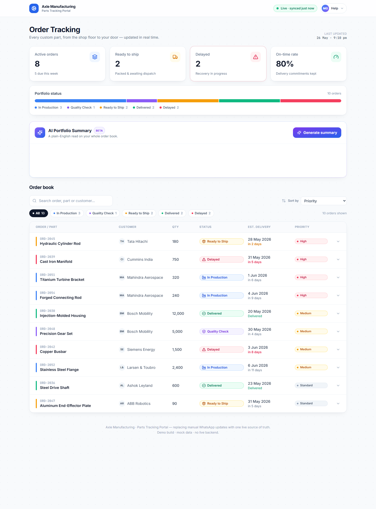

# Axle Manufacturing — Parts Tracking Portal

A polished, single-page **customer-facing order tracking dashboard** for a company
that machines custom parts. It's built to replace the current workflow — staff
manually firing off WhatsApp updates ("your order is in QC now…") — with one
live, trustworthy source of truth.

> **Demo build.** No backend. All data is mocked in `src/data/orders.js` and the
> "AI" summary is generated locally from that data — no LLM call. The goal is to
> feel like a real SaaS manufacturing product you'd ship to a client.



---

## ✨ What's inside

### 1. Customer-facing order tracker
- A responsive **order book** (spreadsheet-style table on desktop, stacked cards
  on mobile) showing Order ID, part, customer, quantity, status, estimated
  delivery and a priority indicator.
- **Search** (order / part / customer), **status filters** with live counts, and
  **sorting** by priority, delivery date or most-recently-updated.
- Click any order to **expand a detailed view**:
  - A **pipeline stepper** (Order Placed → Materials → Production → QC → Ready →
    Shipped → Delivered) showing exactly how far along the order is.
  - A **timestamped activity timeline** — the structured version of the WhatsApp
    thread, with notes at every stage.
  - An **order spec sheet** (material, tolerance, PO, plant/line, production lead,
    dispatch/carrier).
  - For delayed orders, a prominent **"why this is delayed"** banner with the
    reason and original-vs-revised delivery dates.

### 2. Internal team updates (the other half of "replace WhatsApp")
- A **Customer ⇄ Team** toggle in the navbar. The same dashboard serves both
  audiences; Team view unlocks inline editing.
- In Team view, opening any order reveals a **"post an update"** control: pick a
  new status and/or type a note, hit **Post**, and it appends a **timestamped
  entry to the same timeline the customer sees** — and demotes the previous
  "current" step. Marking an order *Delayed* also asks for a revised date and
  reason.
- One action updates **everything at once** — the order's status, the KPI cards,
  the status distribution, and the AI summary (which flags itself "data changed
  — regenerate"). That's the WhatsApp-broadcast workflow, but structured and
  consistent.
- **Edits persist across refresh** via `localStorage` — and a **Reset demo data**
  button restores the seed. Only the *edits* are stored (not the whole book), so
  the seeded orders keep their evergreen, relative-to-today dates while your real
  updates keep their true timestamps. See `utils/persistence.js`.

### 3. AI Portfolio Summary
- A **"Generate summary"** button that produces a plain-English briefing of the
  whole order book — e.g. *"You have 8 active orders… 2 are ready for shipment
  this week… ⚠ Cast Iron Manifold is delayed (a QC issue, now in 5 days)."*
- Staged like a real model call: a short **"analysing…"** beat, then the briefing
  **streams in sentence-by-sentence** with a blinking cursor.
- Surfaces **clickable insight chips** (delayed orders, shipping this week, on
  track, priority watch). Clicking *Delayed* or *Shipping this week* filters the
  table and scrolls to it — the summary doubles as navigation.
- It's **fully dynamic**: change the mock data and the summary changes with it.
  (Logic lives in `src/utils/aiSummary.js`.)

### 4. Status analytics
- Four KPI cards: **Active orders**, **Ready to ship**, **Delayed** (highlighted
  when > 0), and an **On-time rate** "promise kept" trust metric.
- A proportional **status distribution bar** showing the whole book at a glance.

### Polish
- Thoughtful **loading skeletons** (mirror the real layout, no content jump) and
  **empty state** (when filters match nothing).
- Subtle **Framer Motion** animations: progress fills, timeline reveal,
  expand/collapse, hover lifts.
- A faint **blueprint-grid background** and monospace order IDs for an
  industrial-but-premium feel. Honors `prefers-reduced-motion`.

---

## 🚀 Run it locally

Requires **Node 18+** (built and tested on Node 22).

```bash
npm install
npm run dev      # → http://localhost:5173  (opens automatically)
```

Other scripts:

```bash
npm run build    # production build to /dist
npm run preview  # preview the production build
```

---

## 🧱 Project structure

```
src/
├── App.jsx                  # Page shell: state, filtering, sorting, layout
├── main.jsx
├── index.css                # Tailwind layers + design tokens (skeletons, reveal)
├── config/
│   └── statusConfig.js       # Single source of truth: status/priority colours,
│                             #   icons, labels, the pipeline + status→step map
├── data/
│   └── orders.js             # Mock order book (stands in for an ERP feed)
├── utils/
│   ├── format.js             # Date/number helpers (dates are relative to "now")
│   ├── analytics.js          # Portfolio KPIs + status distribution
│   ├── aiSummary.js          # Simulated AI briefing generator
│   └── persistence.js        # localStorage for team edits (override-over-seed)
└── components/
    ├── Navbar.jsx            # Brand, Customer/Team toggle, live-sync, AM popover
    ├── StatsOverview.jsx     # KPI cards + distribution bar
    ├── StatCard.jsx
    ├── AISummaryPanel.jsx    # The AI feature (idle → analysing → streamed result)
    ├── FilterBar.jsx         # Search + status chips + sort
    ├── OrderTable.jsx        # Aligned header + rows
    ├── OrderRow.jsx          # One order (desktop row / mobile card) + expansion
    ├── OrderTimeline.jsx     # Stepper + spec sheet + activity log + delay banner
    ├── TeamUpdatePanel.jsx   # Internal: post a status change / note (Team view)
    ├── StatusBadge.jsx       # Reused everywhere a status appears
    ├── PriorityBadge.jsx
    ├── ProgressBar.jsx
    ├── Reveal.jsx            # CSS-based section entrance
    ├── LoadingState.jsx      # Skeletons
    └── EmptyState.jsx
```

**Stack:** React 18 · Vite 5 · Tailwind CSS 3 · Framer Motion 11 ·
[lucide-react](https://lucide.dev) icons.

---

## 🧠 Product & design decisions (the "why")

The code is commented throughout, but the headline choices:

- **Built to replace WhatsApp, so trust is the product.** Every screen answers
  *"should I be worried, and what's next?"* fast: the live-sync indicator kills
  "is this up to date?" anxiety; the on-time rate is an explicit promise-kept
  metric; delays lead with the *reason* and a revised date rather than hiding
  them; and a named **account manager** is always one tap away as the human
  fallback.
- **One consistent visual language for status.** Colour + icon for each status is
  defined once in `statusConfig.js` and reused in cards, rows, badges, the
  stepper and the timeline — so the same meaning always looks the same.
- **Two views of progress, on purpose.** The *stepper* answers "how far along?"
  at a glance; the *activity log* answers "what happened, and when?". Customers
  ask both.
- **The AI summary is a navigation tool, not a dead end.** Insight chips filter
  the table, so a briefing turns into action.
- **Evergreen demo data.** Dates are computed relative to today (`dayOffset`), so
  an order is always "due in 3 days" whenever the client opens it — exactly how a
  live tracker behaves.
- **Honest about being AI.** The summary footer sets expectations ("always tap an
  order for full detail") — important for trust in any AI feature.

---

## 🔌 Wiring it to a real backend later

Everything funnels through `src/data/orders.js` and the pure helpers in
`src/utils`. To go live, replace the static `ORDERS` import with a fetch into the
same shape (`App.jsx` already simulates the loading state), and the analytics +
AI summary keep working unchanged.
